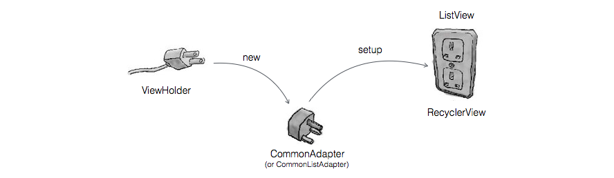

# CommonAdapter

[](https://travis-ci.org/twiceyuan/CommonAdapter)
[](https://jitpack.io/#twiceyuan/CommonAdapter)
[](http://www.apache.org/licenses/LICENSE-2.0)
<a href="http://www.methodscount.com/?lib=com.github.twiceyuan%3ACommonAdapter%3A0.3"></img></a>
<a href="http://www.methodscount.com/?lib=com.github.twiceyuan%3ACommonAdapter%3A0.3"></img></a>

一个 ListView / RecyclerView 通用的适配器

[English](README.md)

* [x] 可以当做一个 ListView / RecyclerView 通用的 adapter.
* [x] 支持（而且更加方便） RecyclerView 的多 view type 布局. 这里有一个 [demo](https://github.com/twiceyuan/RecyclerViewType) 来演示如何使用本项目实现多 ViewType 的 RecyclerView 



# 引用

```groovy
allprojects {
	repositories {
		// ...
		maven { url "https://jitpack.io" }
	}
}
```
```groovy
compile("com.github.twiceyuan:CommonAdapter:$COMMON_ADAPTER_VERSION") {
  exclude group: 'com.android.support', module: 'recyclerview-v7'
}
```

# 使用

1. 创建一个 ViewHolder 并继承 CommonHolder\<T\>，T 为实体数据类型

  ```java
  // 绑定布局资源
  @LayoutId(R.layout.item_person)
  public class PersonHolder extends CommonHolder<Person> {
  
      // 绑定 View 资源
      @ViewId(R.id.name) TextView name;
      @ViewId(R.id.email) TextView email;
  
      // 绑定数据
      @Override public void bindData(Person person) {
          name.setText(person.name);
          email.setText(person.email);
      }
  }
  ```

2. 创建适配器并配置到 ListView 或者 RecyclerView 上

    **RecyclerView Adapter**
    
    ```java
    // 构造适配器
    CommonAdapter<Person, PersonHolder> recyclerAdapter = new CommonAdapter<>(this, PersonHolder.class);

    // 配置适配器
    mRecyclerView.setAdapter(recyclerAdapter);
    ```
    
    **ListView Adapter**
    
    ```java
    // 构造适配器
    CommonListAdapter<Person, PersonHolder> listAdapter = new CommonListAdapter<>(this, PersonHolder.class);
    
    // 配置适配器
    mListView.setAdapter(listAdapter);
    ```

    **配置监听器 (通过 Holder)** 
    
    ```java
    recyclerAdapter.setOnBindListener((position, person, holder) -> {
        // holder 用于直接对 view 配置监听器
        holder.name.setOnClickListener((v) -> toast(person.name));
        holder.email.setOnClickListener((v) -> toast(person.email));
    });
    ```

# 混淆过滤（Proguard）

```
-keepattributes *Annotation*
-keepclassmembers class * extends com.twiceyuan.commonadapter.library.holder.CommonHolder {
    public <init>(...);
}
```

# 感谢

* EasyAdapter https://github.com/ribot/easy-adapter

# 许可
```
Copyright 2016 twiceYuan.

Licensed under the Apache License, Version 2.0 (the "License");
you may not use this file except in compliance with the License.
You may obtain a copy of the License at

   http://www.apache.org/licenses/LICENSE-2.0

Unless required by applicable law or agreed to in writing, software
distributed under the License is distributed on an "AS IS" BASIS,
WITHOUT WARRANTIES OR CONDITIONS OF ANY KIND, either express or implied.
See the License for the specific language governing permissions and
limitations under the License.
```
